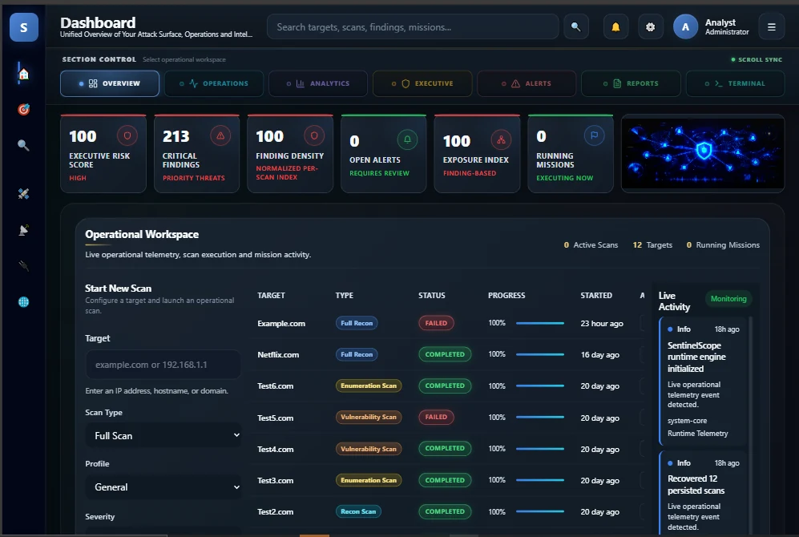
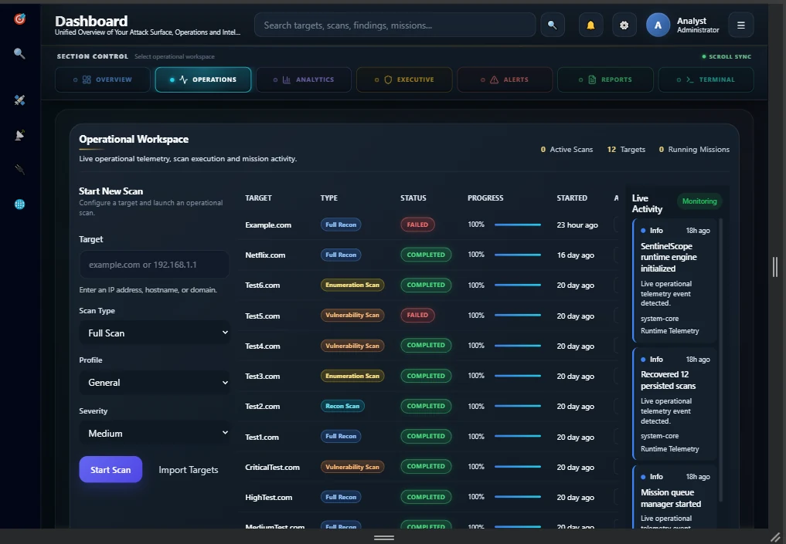
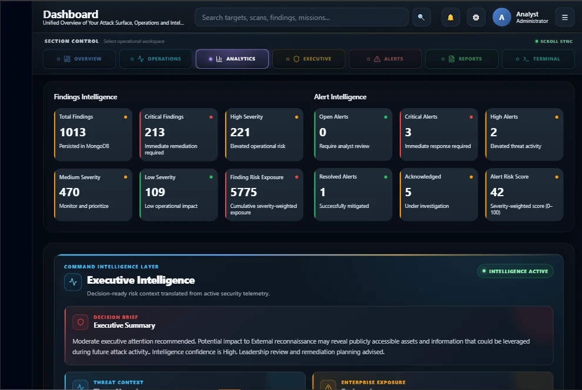
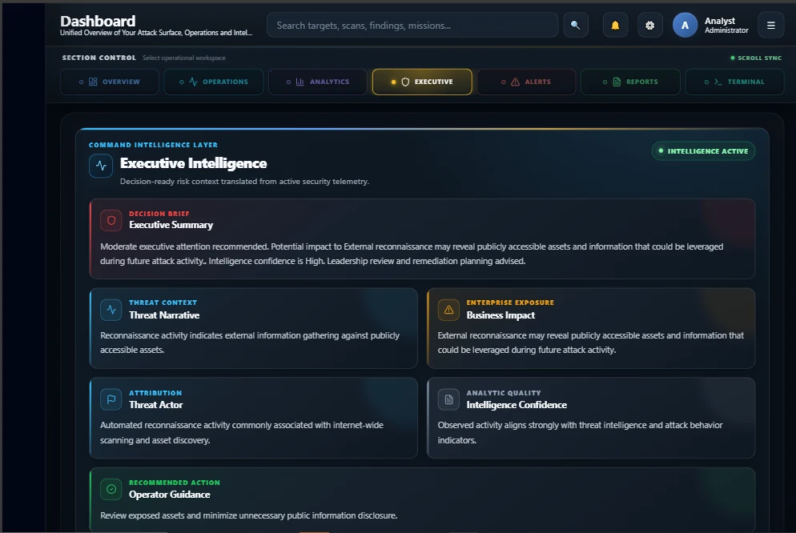
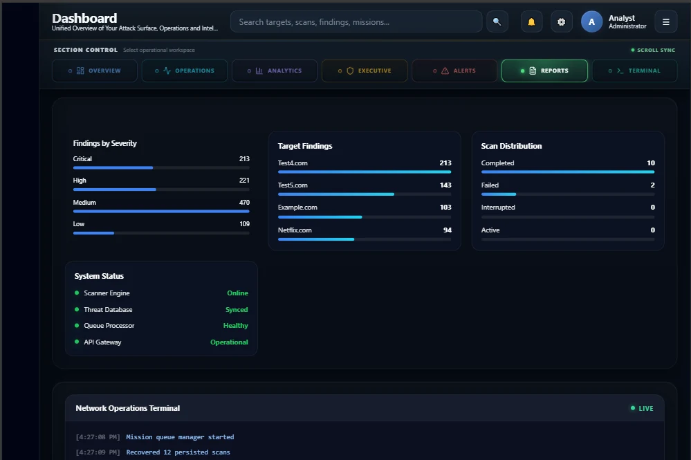
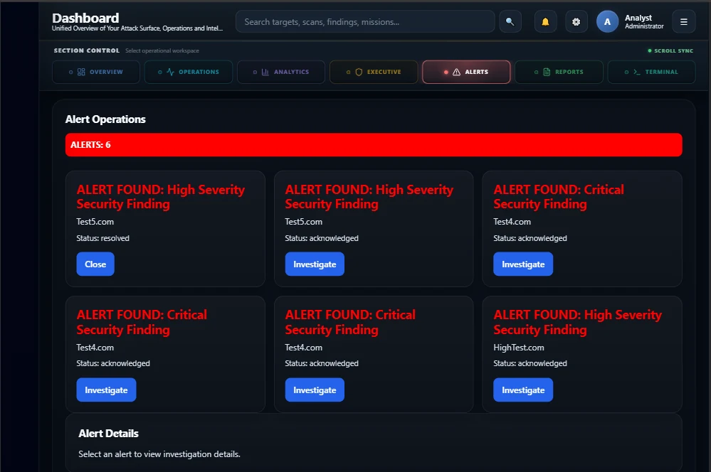
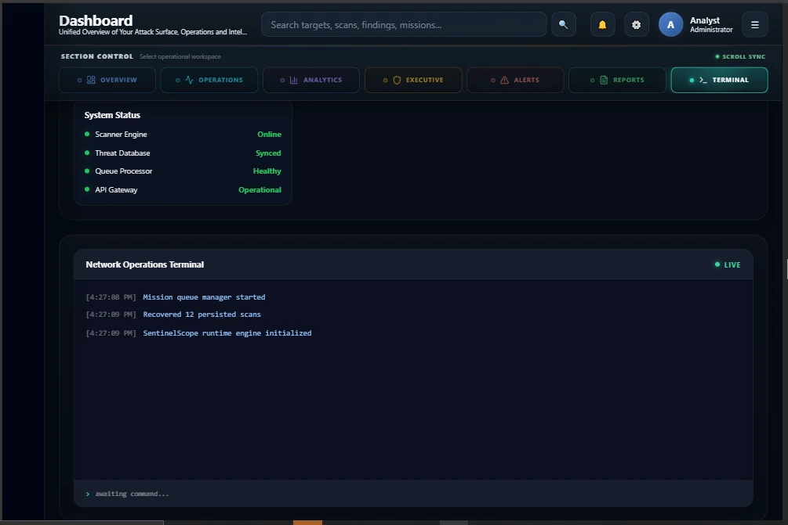

# 🛡️ SentinelScope


SentinelScope is a full-stack cybersecurity operations and intelligence
dashboard built to demonstrate persistent scan orchestration, mission tracking,
findings analysis, alert operations, risk correlation, executive intelligence,
and operational telemetry through a responsive SOC-style interface.

The frontend is deployed on Vercel and communicates with a separately deployed
Node.js and Express API backed by MongoDB.

## Live Deployment

| Service | Deployment |
| --- | --- |
| Frontend Application | [Open SentinelScope](https://sentinelscope-react.vercel.app) |
| Backend API | [Open API](https://sentinelscope-express.onrender.com/api) |
| Frontend Repository | [FHobbs8030/sentinelscope-react](https://github.com/FHobbs8030/sentinelscope-react) |
| Backend Repository | [FHobbs8030/sentinelscope-express](https://github.com/FHobbs8030/sentinelscope-express) |

## Current Milestone

**V2.11 — Dashboard Control Navigation**

The current release introduces a fixed SOC-style navigation layer beneath the
main dashboard header.

V2.11 includes:

- Illuminated, color-coded dashboard section controls
- Smooth navigation between major intelligence workspaces
- Automatic active-section synchronization while scrolling
- Responsive horizontal navigation for narrow displays
- Correct fixed-header and section-anchor offsets
- Improved initial dashboard positioning
- Removal of duplicate Alert Operations telemetry
- Production Vite build validation
- Responsive desktop and narrow-screen review

## Dashboard Overview



The dashboard combines operational telemetry, intelligence analysis, alert
investigation, reporting, and terminal activity in one unified workspace.

The fixed control panel provides direct access to:

- Overview
- Operations
- Analytics
- Executive Intelligence
- Alert Operations
- Reports
- Network Operations Terminal

## Platform Capabilities

### Mission Operations

SentinelScope maintains mission records that organize and contextualize scan
activity.

Mission capabilities include:

- Persistent mission records
- Mission lifecycle tracking
- Mission-to-scan relationships
- Mission ownership metadata
- Mission metrics and status summaries
- Mission activity synchronization

### Scan Operations

Scan execution data is managed through the frontend runtime and persisted
through the backend API.

Scan capabilities include:

- Scan creation and queue management
- Scan status tracking
- Scan type classification
- Progress and stage telemetry
- Runtime state persistence
- Recovery of persisted scan state
- Duplicate scan protection
- Completed, failed, interrupted, queued, and running states
- Findings generation and scan outcome metrics

### Findings Intelligence

Findings generated through scan workflows are persisted and presented through
severity, risk, and correlation views.

Findings capabilities include:

- Critical, high, medium, and low severity classification
- Persisted finding records
- Finding-to-scan relationships
- Finding-to-alert relationships
- Severity distribution analysis
- Risk scoring
- Recommended response actions
- Related asset and intelligence context

### Alert Operations

Alert records are derived from operational findings and managed through a
dedicated investigation workspace.

Alert capabilities include:

- Persistent alert records
- Alert severity and status tracking
- Alert lifecycle operations
- Related findings inspection
- Threat context enrichment
- Business impact analysis
- MITRE ATT&CK context
- Intelligence confidence scoring
- Alert selection and investigation workflows

### Intelligence and Correlation

The platform combines operational records into higher-level security
intelligence.

Intelligence capabilities include:

- Threat context generation
- Threat narrative intelligence
- Business impact assessment
- Threat actor profiling
- MITRE ATT&CK mapping
- Confidence scoring
- Dynamic risk assessment
- Finding and alert correlation
- Asset-level intelligence
- Executive risk summaries

## Operational Workspace



The Operational Workspace provides scan controls, recent scan telemetry,
findings severity analysis, operational summaries, and live activity data.

Key elements include:

- Scan launch controls
- Recent scan status table
- Operational summary metrics
- Findings severity visualization
- Mission and scan activity feed
- Queue and runtime indicators

## Findings and Alert Intelligence



This section presents persisted findings and alert data through severity,
status, risk, and operational intelligence views.

It provides:

- Findings totals
- Severity distribution
- Active alert metrics
- Risk indicators
- Alert intelligence summaries
- Operational investigation context

## Executive Intelligence



Executive Intelligence transforms operational security records into concise
risk and decision-support information.

The workspace includes:

- Executive risk posture
- Critical exposure summaries
- Threat coverage metrics
- Active alert intelligence
- Attack surface indicators
- Mission and scan status
- Prioritized security assessment
- Recommended operational actions

## Correlation Intelligence



Correlation Intelligence connects findings, alerts, assets, severity, and
operational events to provide a broader view of security activity.

The section supports:

- Related finding analysis
- Alert-to-finding relationships
- Severity correlation
- Asset exposure context
- Risk concentration analysis
- Intelligence confidence indicators

## Alert Operations



Alert Operations provides a focused workspace for reviewing active security
alerts and their associated intelligence.

The workspace includes:

- Alert inventory
- Severity and status indicators
- Selected alert details
- Related findings
- Threat context
- Business impact
- Recommended actions
- Alert lifecycle management

## Network Operations Terminal



The Network Operations Terminal presents timestamped operational events,
runtime updates, scan activity, mission activity, and system telemetry in a
terminal-inspired interface.

## Persistent Data Architecture

SentinelScope no longer depends only on browser-local demonstration state.

The deployed frontend communicates with the backend API to persist and retrieve
operational records from MongoDB.

Persisted domain records include:

- Missions
- Scans
- Findings
- Alerts
- Runtime state
- Intelligence metadata
- Operational activity

A simplified data flow is:

```text
User Action
    ↓
React Dashboard
    ↓
Frontend API Services
    ↓
Node.js / Express REST API
    ↓
Mongoose Data Models
    ↓
MongoDB Persistence
    ↓
Hydrated Dashboard State
```

The operational intelligence pipeline follows this general sequence:

```text
Mission
    ↓
Scan Runtime
    ↓
Findings
    ↓
Alerts
    ↓
Threat Context
    ↓
Risk and Correlation Intelligence
    ↓
Executive Intelligence
    ↓
MongoDB Persistence
    ↓
Dashboard Presentation
```

## Deployment Architecture

```text
┌───────────────────────────────────┐
│ Vercel                            │
│ React 19 + Vite 8 Frontend        │
└────────────────┬──────────────────┘
                 │ HTTPS REST requests
                 ▼
┌───────────────────────────────────┐
│ Render                            │
│ Node.js + Express Backend API     │
└────────────────┬──────────────────┘
                 │ Mongoose
                 ▼
┌───────────────────────────────────┐
│ MongoDB                           │
│ Missions, Scans, Findings, Alerts │
└───────────────────────────────────┘
```

## Technology Stack

### Frontend

- React 19
- React DOM
- React Router
- Vite 8
- JavaScript ES modules
- Lucide React icons
- CSS custom properties
- Responsive grid and flexbox layouts
- Modular component architecture
- REST API service layer

### Backend

The production backend is maintained in the separate
[`sentinelscope-express`](https://github.com/FHobbs8030/sentinelscope-express)
repository.

Its primary technologies include:

- Node.js
- Express
- MongoDB
- Mongoose
- RESTful API routes
- Persistence services
- Runtime recovery services
- Mission, scan, finding, and alert models
- CORS configuration for local and deployed clients

### Deployment

- Vercel for the React frontend
- Render for the Express backend
- MongoDB for persistent operational data
- GitHub for source control and milestone management

## Frontend Repository Structure

```text
sentinelscope-react/
├── client/
│   ├── public/
│   ├── src/
│   │   ├── assets/
│   │   ├── components/
│   │   ├── hooks/
│   │   ├── pages/
│   │   │   └── Dashboard/
│   │   ├── services/
│   │   │   └── api/
│   │   ├── styles/
│   │   └── utils/
│   ├── .env.example
│   ├── package.json
│   ├── vercel.json
│   └── vite.config.js
├── docs/
│   ├── diagrams/
│   ├── reports/
│   ├── screenshots/
│   └── UI_RULES.md
├── server/
├── CHANGELOG.md
├── ROADMAP.md
└── README.md
```

The active production frontend is located in `client/`.

The production API is developed and deployed from the separate backend
repository.

## Local Installation

### Prerequisites

Install the following before running the project:

- Node.js
- npm
- Git
- A running SentinelScope backend API, or access to the deployed API

### Clone the Frontend

```bash
git clone https://github.com/FHobbs8030/sentinelscope-react.git
cd sentinelscope-react/client
npm install
```

### Configure the Environment

Copy the provided example:

```bash
cp .env.example .env.local
```

For a locally running backend:

```env
VITE_API_BASE_URL=http://localhost:3001/api
```

To use the deployed backend:

```env
VITE_API_BASE_URL=https://sentinelscope-express.onrender.com/api
```

Do not commit `.env.local`.

### Start the Development Server

```bash
npm run dev
```

Vite will display the local development address in the terminal.

## Available Scripts

Run these commands from the `client` directory.

### Development

```bash
npm run dev
```

Starts the Vite development server.

### Production Build

```bash
npm run build
```

Creates an optimized production bundle in `client/dist`.

### Lint

```bash
npm run lint
```

Runs ESLint across the frontend source.

### Preview

```bash
npm run preview
```

Serves the production build locally for verification.

## Production Environment

The Vercel deployment must define:

```env
VITE_API_BASE_URL=https://sentinelscope-express.onrender.com/api
```

The frontend API configuration removes trailing slashes and builds normalized
endpoint URLs from this base value.

The Vercel configuration also rewrites frontend routes to `index.html`, allowing
React Router routes to load correctly when opened directly.

## Design System

SentinelScope uses a tactical SOC-inspired visual system designed around:

- Dark operational surfaces
- Semantic severity colors
- Illuminated status indicators
- Compact intelligence cards
- Responsive workspace grids
- Fixed operational controls
- High-density dashboard presentation
- Consistent spacing and typography tokens
- Desktop, tablet, and mobile layout behavior

The project-specific interface rules are documented in:

```text
docs/UI_RULES.md
```

## Completed V2 Milestones

- **V2.5** — Operations workspace table optimization
- **V2.6** — Runtime outcome variation and SOC status system
- **V2.7** — KPI intelligence ribbon
- **V2.8** — Operational summary intelligence
- **V2.9** — Production deployment readiness
- **V2.10** — Executive intelligence visual polish
- **V2.11** — Dashboard control navigation

## Validation

The current V2.11 milestone has been validated with:

- Successful Vite production build
- Clean `git diff --check`
- Frontend and backend production connectivity
- Desktop layout review
- Narrow responsive layout review
- Fixed navigation and anchor-offset review
- Direct section-navigation testing
- Active-section synchronization testing

## Project Scope

SentinelScope demonstrates full-stack software engineering across:

- React component architecture
- REST API integration
- Persistent MongoDB data
- Runtime state management
- Responsive interface engineering
- Security-oriented data modeling
- Dashboard intelligence visualization
- Cloud deployment
- Git feature-branch workflows
- Milestone and release management

The platform is designed as an extensible cybersecurity operations project.
Additional scanner adapters, external intelligence feeds, authentication,
authorization, and enterprise integrations can be added as the architecture
continues to evolve.

## Roadmap

Planned areas of continued development include:

- Authentication and user accounts
- Role-based access control
- Multi-user workspaces
- Expanded scanner integrations
- External threat intelligence feeds
- Incident response workflows
- Report generation and export
- Scheduled scans and missions
- Notification services
- Administrative controls
- Additional asset correlation
- Historical intelligence trends

See [`ROADMAP.md`](ROADMAP.md) for broader project planning.

## Author

**Fred Hobbs**

- GitHub: [FHobbs8030](https://github.com/FHobbs8030)
- Frontend repository:
  [sentinelscope-react](https://github.com/FHobbs8030/sentinelscope-react)
- Backend repository:
  [sentinelscope-express](https://github.com/FHobbs8030/sentinelscope-express)

## License

This project is licensed under the MIT License.
