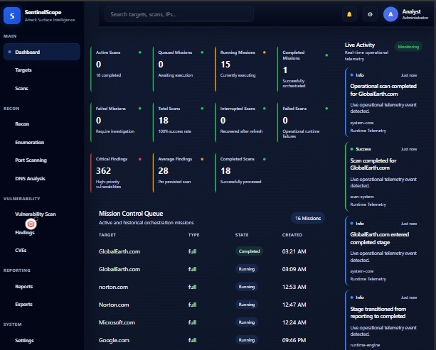
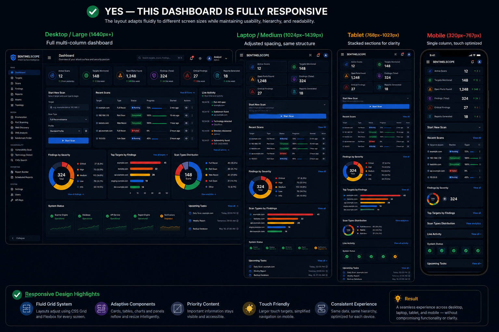
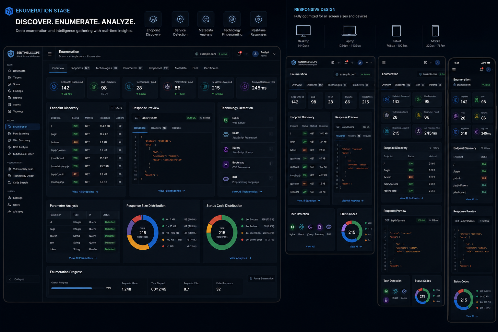
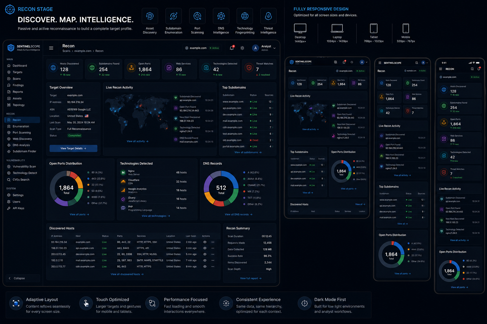
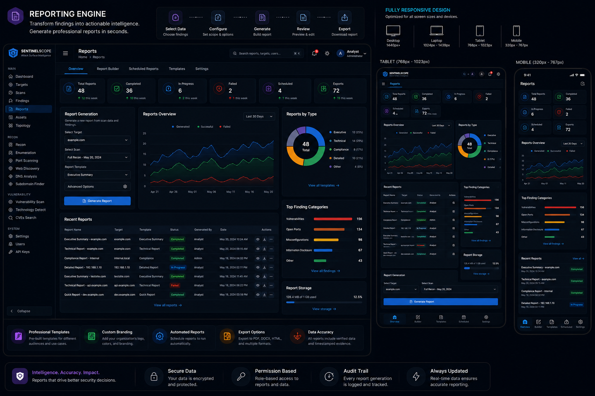
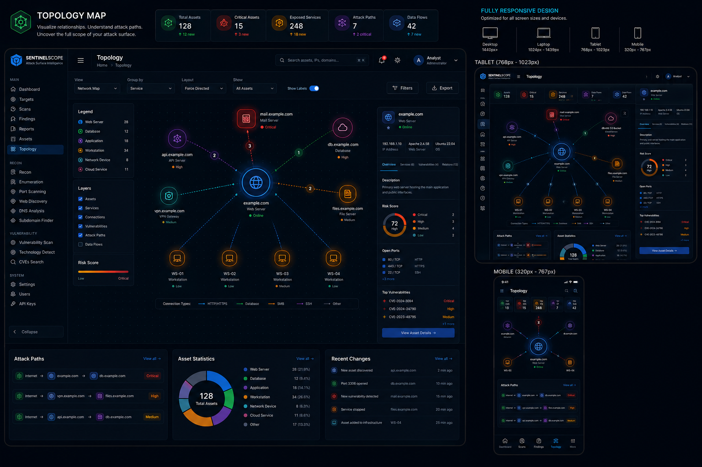
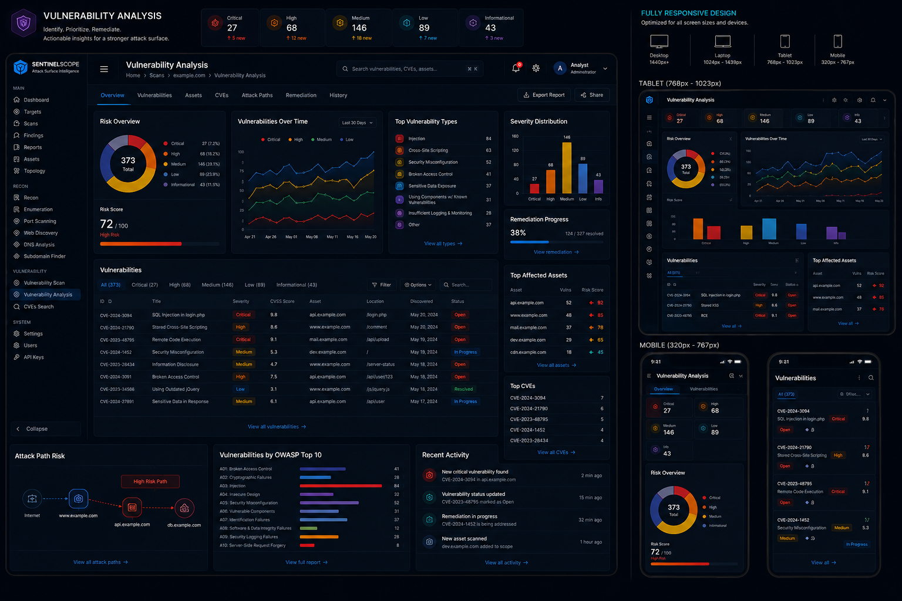
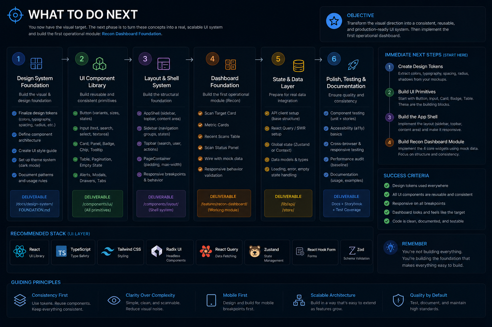

# 🛡️ SentinelScope


> Tactical cybersecurity intelligence and reconnaissance platform built with React, Vite, Node.js, Express, MongoDB Atlas, and a modular dashboard architecture.

---

## Foundation Milestone Achieved

## SentinelScope Intelligence Platform Foundation

### Release Tag

`v0.8.0-intelligence-foundation`

### Completed Milestones

* Phase 1 — Persistence Foundation
* Phase 2 — Operational Intelligence
* Phase 3A — Risk Intelligence
* Phase 3B.1 — Threat Narrative Intelligence
* Phase 3B.2 — Business Impact Intelligence
* Phase 3B.3 — Threat Actor Intelligence
* Phase 3B.4 — MITRE ATT&CK Intelligence
* Phase 3B.5 — Intelligence Confidence Scoring
* Phase 3B.6 — Executive Risk Intelligence

This milestone establishes SentinelScope as a persistent operational intelligence platform capable of mission orchestration, threat enrichment, risk assessment, executive intelligence, alert intelligence, runtime recovery, and dashboard analytics.

---

## Project Status

### Intelligence Platform Foundation Complete

### Completed

* Scan Persistence
* Mission Persistence
* Runtime Recovery
* Findings Intelligence
* Alert Intelligence
* Threat Context Intelligence
* Threat Narrative Intelligence
* Business Impact Intelligence
* Threat Actor Intelligence
* MITRE ATT&CK Intelligence
* Intelligence Confidence Scoring
* Risk Assessment Engine
* Executive Risk Intelligence

### Current Development

#### Phase UX-1 — Dashboard Modernization & Widget Framework

---

## 🚀 Project Overview

SentinelScope has evolved into a persistent cybersecurity operations and intelligence platform featuring mission management, scan orchestration, findings intelligence, alert intelligence, runtime recovery, operational telemetry, threat intelligence enrichment, executive intelligence, MongoDB-backed persistence, and responsive dashboard analytics.

### Verified Intelligence Pipeline

```text
Mission
   ↓
Scan Runtime Engine
   ↓
Finding Generation
   ↓
Alert Generation
   ↓
Threat Context Intelligence
   ↓
Threat Narrative Intelligence
   ↓
Business Impact Intelligence
   ↓
Threat Actor Intelligence
   ↓
MITRE ATT&CK Mapping
   ↓
Risk Assessment
   ↓
Intelligence Confidence
   ↓
Executive Risk Intelligence
   ↓
MongoDB Persistence
   ↓
Dashboard Intelligence
```
<!-- markdownlint-disable MD033 -->
---

## 🚀 Platform Evolution


<table>
<tr>

<td width="50%" align="center" valign="top">

### Version 1.0

Current Operational Platform



<hr>

#### Current Capabilities

<ul align="left">
  <li>Mission Orchestration</li>
  <li>Scan Intelligence</li>
  <li>Findings Intelligence</li>
  <li>Alert Intelligence</li>
  <li>Threat Intelligence</li>
  <li>Executive Risk Intelligence</li>
  <li>Runtime Recovery</li>
  <li>Operational Telemetry</li>
  <li>Dashboard Analytics</li>
</ul>

</td>

<td width="50%" align="center" valign="top">

### Version 2.0

Future Executive Security Workspace



<hr>

#### Planned Enhancements

<ul align="left">
  <li>Customizable Widgets</li>
  <li>Drag-and-Drop Dashboard Layouts</li>
  <li>Executive Intelligence Center</li>
  <li>Saved User Workspaces</li>
  <li>Advanced Analytics</li>
  <li>Asset Correlation Intelligence</li>
  <li>Incident Response Intelligence</li>
  <li>Executive Reporting</li>
  <li>Enhanced Visualization Framework</li>
</ul>

</td>
</table>

---
<!-- markdownlint-enable MD033 -->

### Evolution Strategy

SentinelScope Version 1 establishes a complete cybersecurity intelligence platform featuring mission orchestration, threat intelligence, executive risk intelligence, operational telemetry, findings intelligence, alert intelligence, and persistent dashboard analytics.

SentinelScope Version 2 expands the platform into a fully customizable executive security workspace where users can organize dashboard widgets, personalize operational views, create executive workspaces, and leverage advanced intelligence visualization while building upon the Intelligence Platform Foundation established in Version 1.

The objective is not to replace the existing platform, but to evolve it into a next-generation security operations environment while preserving the intelligence architecture, persistence layer, and operational capabilities already implemented.

---

<!-- markdownlint-disable MD033 -->

## 📸 Platform Screenshots

### Dashboard Preview


---

### Enumeration Stage



---

### Recon Stage



---

### Reporting Engine



---

### Topology Map



---

### Vulnerability Analysis



---

### What To Do Next



<!-- markdownlint-enable MD033 -->

## 🧠 Core Features

### 🎯 Mission Operations

* Mission Persistence
* Mission Hydration
* Mission Ownership Tracking
* Mission-to-Scan Relationships
* Mission Synchronization
* Operational Lifecycle Management

### 🌐 Scan Intelligence

* Scan Orchestration
* Runtime Persistence
* Runtime Recovery
* True Scan Resume
* Duplicate Scan Prevention
* Scan State Intelligence

### 🛡️ Findings & Alert Operations

* Findings Persistence
* Alert Persistence
* Severity Classification
* Alert Lifecycle Tracking
* Related Findings Correlation
* Operational Alert Management

### 🧠 Intelligence Engine

#### Threat Intelligence

* Threat Context Generation
* Threat Narrative Generation
* Business Impact Assessment
* Threat Actor Profiling
* MITRE ATT&CK Mapping
* Intelligence Confidence Scoring
* Dynamic Risk Scoring
* Recommended Actions
* Related Findings Correlation

#### Operational Intelligence

* Mission Intelligence
* Scan Intelligence
* Findings Intelligence
* Alert Intelligence
* Runtime Telemetry
* Activity Monitoring
* Recovery Intelligence

---

## ⚙️ Frontend Stack

* React
* Vite
* JavaScript (ES Modules)
* Responsive Dashboard Architecture
* Tactical Dark Theme UI
* Modular Component System
* Event-Driven Runtime Integration

---

## ⚙️ Backend Stack

* Node.js
* Express
* MongoDB Atlas
* Mongoose
* REST APIs
* Mission Persistence Services
* Scan Persistence Services
* Findings Persistence Services
* Alert Persistence Services
* Runtime Recovery Services
* Threat Intelligence Services

---

## 🔥 Current Development Status

### ✅ Completed

* Mission Persistence
* Scan Persistence
* Findings Persistence
* Alert Persistence
* Runtime Recovery
* Mission Synchronization
* Duplicate Scan Prevention
* Findings Intelligence
* Alert Intelligence
* Threat Context Intelligence
* Threat Narrative Intelligence
* Business Impact Intelligence
* Threat Actor Intelligence
* MITRE ATT&CK Intelligence
* Intelligence Confidence Scoring
* Dynamic Risk Scoring
* Alert Lifecycle Operations
* MongoDB Atlas Integration
* Operational Telemetry
* Dashboard Intelligence

### 🚧 Current Phase

#### Phase 3B.6 — Executive Risk Intelligence

### 🔮 Planned

* Incident Management
* Reporting Engine
* PDF Export Generation
* Asset Correlation
* Attack Surface Intelligence
* Scan Scheduling
* Multi-User Support
* Role-Based Access Control
* Administrative Intelligence Center

---

## 📈 Project Progress

| Area                      | Completion |
| ------------------------- | ---------- |
| Frontend Dashboard        | 96%        |
| Backend Services          | 95%        |
| Runtime Engine            | 100%       |
| Persistence Layer         | 100%       |
| Mission Management        | 100%       |
| Findings Intelligence     | 100%       |
| Alert Intelligence        | 100%       |
| Threat Intelligence       | 100%       |
| MITRE ATT&CK Intelligence | 100%       |
| Reporting Engine          | 45%        |

## Core Intelligence Platform Complete

SentinelScope now provides a complete operational intelligence workflow from mission creation through threat-enriched alert generation, risk assessment, persistence, telemetry, and dashboard intelligence.

---

## 🛠️ Installation

```bash
git clone https://github.com/FHobbs8030/sentinelscope-react.git
cd sentinelscope-react
cd client
npm install
npm run dev
```

---

## 🔗 Repository Links

### Frontend Repository

<https://github.com/FHobbs8030/sentinelscope-react>

### Backend Repository

<https://github.com/FHobbs8030/sentinelscope-express>

---

## 🧠 Engineering Principles

* Modularity
* Scalability
* Maintainability
* Runtime Resiliency
* Observability
* Operational Clarity
* Long-Term Extensibility

---

## 🛰️ Future Vision

SentinelScope is evolving into a cybersecurity operations and intelligence platform that combines scan orchestration, threat intelligence, risk assessment, operational telemetry, incident response workflows, executive reporting, and security operations intelligence into a unified operational environment.

Future releases will expand intelligence correlation, executive risk reporting, attack surface management, multi-user operations, incident management, and advanced threat analysis capabilities while maintaining a modular, scalable architecture.
